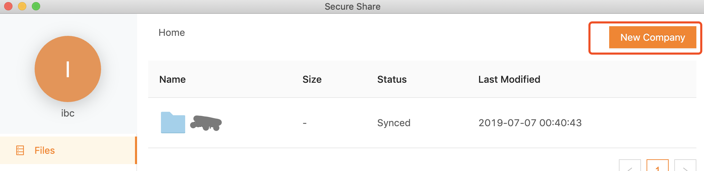

# 0 Introduction

Secured-Share is a secure end-to-end file sharing App based on Amazon AWS tech stack(S3, Cognito).

# 1 Requirement

- Windows 10 OS/ Windows Server 2016
- Make sure local port 18080 is available (This port is for local use only)
- Make sure the backup machine has the same domain name. Check the domain name in cmd prompt by running ```systeminfo | findstr /B /C:"Domain"``` (Only for windows, except for Linux)

# 2 Security Spec

- AES key size: 256 bit
- RSA key size: 2048 bit (2048-bit keys are sufficient until 2030)
- RSA private key are encrypted by specific domain name stored.
- Create separate AWS Cognito accounts for each user which provides additional security isolation.

# 3 Quick Setup

Note:

*{SECURE_SHARE_ROOT_PATH}: Root folder of secure-share app*

*{HOME}: Home folder of current user*

### 3.0 Windows Setup

- Install NodeJS and dependencies. Open a command prompt(cmd).  ```cd {SECURE_SHARE_ROOT_PATH}\secure-share\resources\app\assets\cfg\``` Run ```node-install.bat```
- In a command prompt(cmd), type `node -v` to check the install version of nodeJS. You will see `v10.16.0`
- Run secure-share.exe to launch app.

#### Windows Troubleshooting
- If you cannot open the app. Open a command prompt(cmd).
    - ```cd {SECURE_SHARE_ROOT_PATH}\secure-share\resources\app\assets\js\```
    - ```node SecureShareService.js```
    - If it shows some error like "cannot find module XXX", then run ```npm install node-windows@0.1.14 express@4.17.1 body-parser@1.19.0 aes256@1.0.4 node-rsa@1.0.5 fast-sha256@1.1.0 aws-sdk@2.477.0 amazon-cognito-identity-js@3.0.13 node-fetch@2.6.0 bluebird@3.5.3 forever-monitor@^1.7.1 forever@^1.0.0 axios@^0.19.0```

### 3.1 Linux Setup
####Environment Setup
- Install Linux dependency ```yum install libXScrnSaver```
- ```sudo chown root:$USER {SECURE_SHARE_ROOT_PATH}/chrome-sandbox```
  ```sudo chmod 4755 {SECURE_SHARE_ROOT_PATH}/chrome-sandbox```

- Find NodeJS install package ```{SECURE_SHARE_ROOT_PATH}\secure-share\resources\app\assets\cfg\node-v10.16.0-linux-x64.tar.xz```
- Unzip the zip file and follow the instructions to install NodeJS in https://github.com/nodejs/help/wiki/Installation
####Initialize for New Build
- In a terminal, run `npm install express@4.17.1 body-parser@1.19.0 aes256@1.0.4 node-rsa@1.0.5 fast-sha256@1.1.0 aws-sdk@2.477.0 amazon-cognito-identity-js@3.0.13 node-fetch@2.6.0 bluebird@3.5.3 forever-monitor@^1.7.1 forever@^1.0.0 axios@^0.19.0`
- Run ```./secure-share``` to launch app

# 4 User Manual

### 4.0 Logon (Only ibc has the privilege to create account)

- Press `alt` key using keyboard and click `connect` button simultaneously to navigate to logon page.

- Logon `ibc` user and then login `ibc`

- In the page `Files`, click `New Company` button on the top-right corner to create new account for client.

- In Cognito User Pools, find the new created account and click "Confirm User" to confirm.




### 4.1 Login and initial Setup

- Login app using the username and password provided by ibc.

- Click `Credentials` page to generate a RSA key pair.

- Within one or two minutes, after the ibc and client finish the public key exchange (Red missing button changes to green), the app is ready to share files.


### 4.2 Upload Files

- Drag and drop the files you want to send to ibc into daily folder `2019-xx-xx\`.
- Or you can directly put them in `{SECURE_SHARE_ROOT_PATH}\secure-share\data\abc\uploads\2019-xx-xx`
- When the files are uploaded to S3 successfully, it will show in the app `Files` page.

### 4.3 Download Files

- Files will be automatically downloaded and placed in `{SECURE_SHARE_ROOT_PATH}\secure-share\data\abc\downloads\2019-xx-xx`
- In the app, you can also click `open folder` of the file to open the download folder.

### 4.4 Maintenance Log

- In `Maintenance` page, users can check file-transfer-logs by click `File-Transfer-Log`

### 4.5 Setting

- **Sync Days**: Automatically Upload/Download files based on the timestamp folder(2019-XX-XX). (Default is sync the folder in last 7 days).
- **Sync Frequency**: The frequency to Upload/Download files from S3.
- **Auto Delete**: Auto delete old folders and all the including files.
- **Register windows service**: Register/Unregister windows Service.
    - After click "save changes", it will prompt up some confirm page from system, please click "continue"
    - In the windows services page, find a service named "secure-share" and set the logon name(username and password) same as you used for the secure-share app.

### 4.6 Logout App

- The app is designed for long term running. To logout, delete files `scylla` at `${HOME}/secure-share/meta/`

### 4.7 How to reset a client user (For ibc Admin Only)

For example, if the client user is `abc`,

- **In IBC's computer**
  1. Remove the following directories:
    - `${HOME}/secure-share/meta/abc`
    - `${HOME}/secure-share/data/abc`
  2. Remove the following files:
    - `${HOME}/secure-share/meta/ibc/ibc-abc-public.txt`
    - `${HOME}/secure-share/meta/ibc/ibc-abc-private.txt`
  3. Open S3 console, delete folder `abc` in your bucket
  4. Open Cognito console, delete user `abc`

- **In client's computer**, just remove the whole folder `${HOME}/secure-share`
