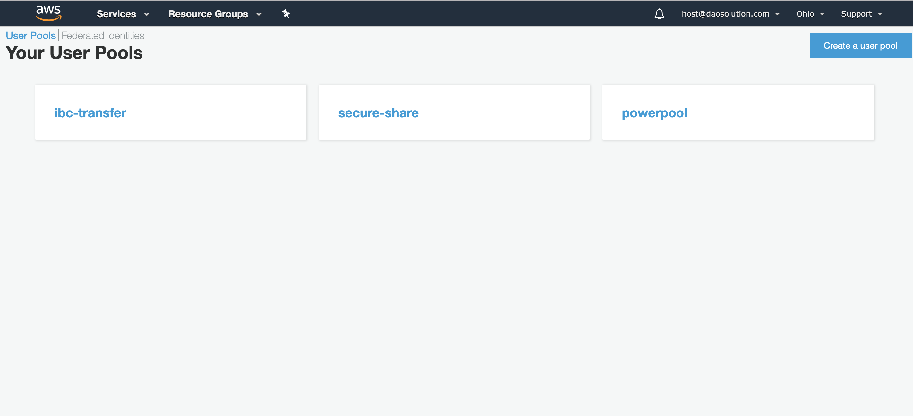
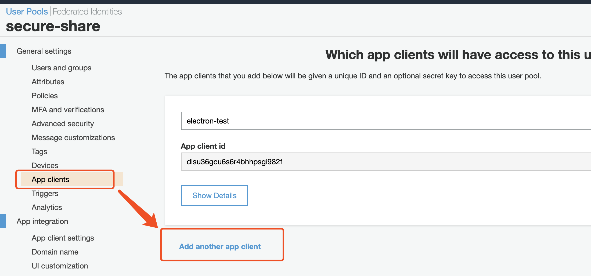
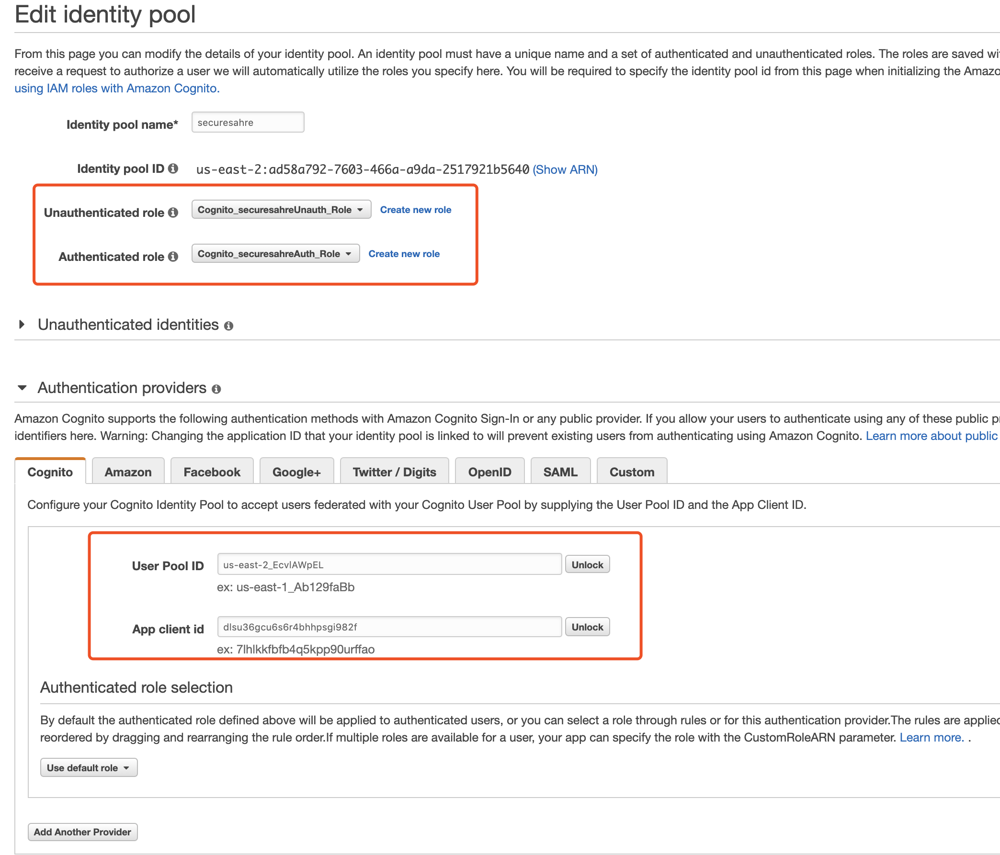
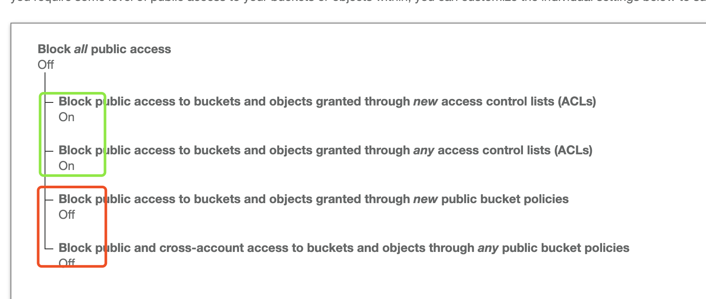
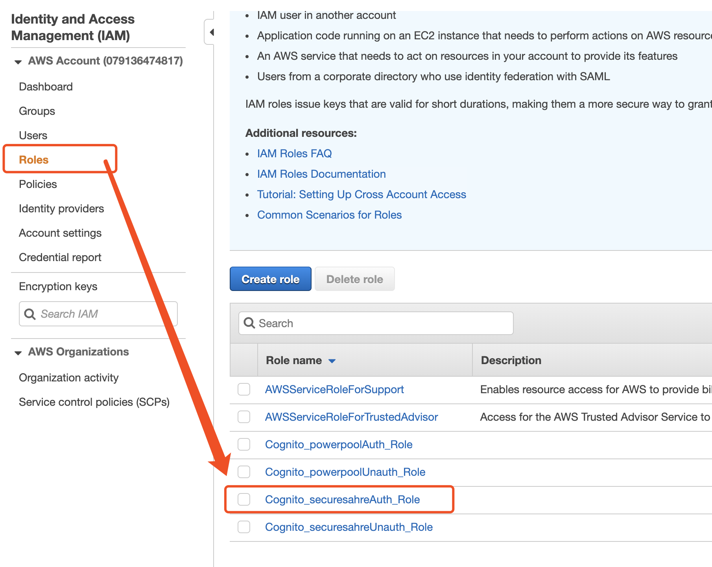
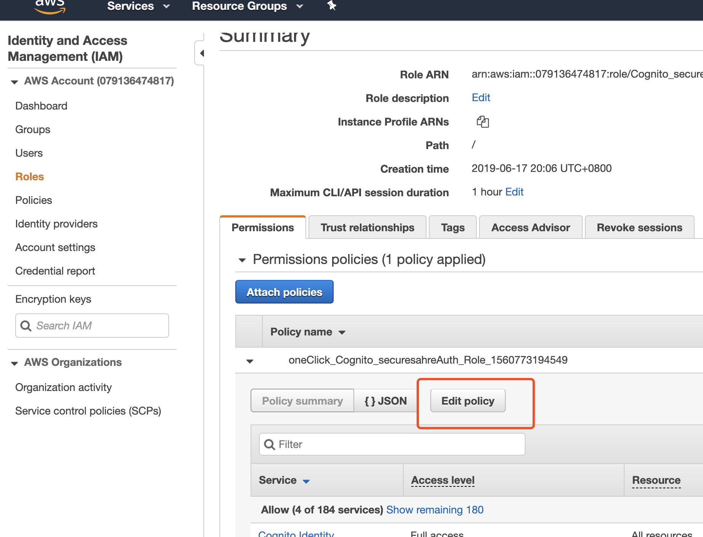
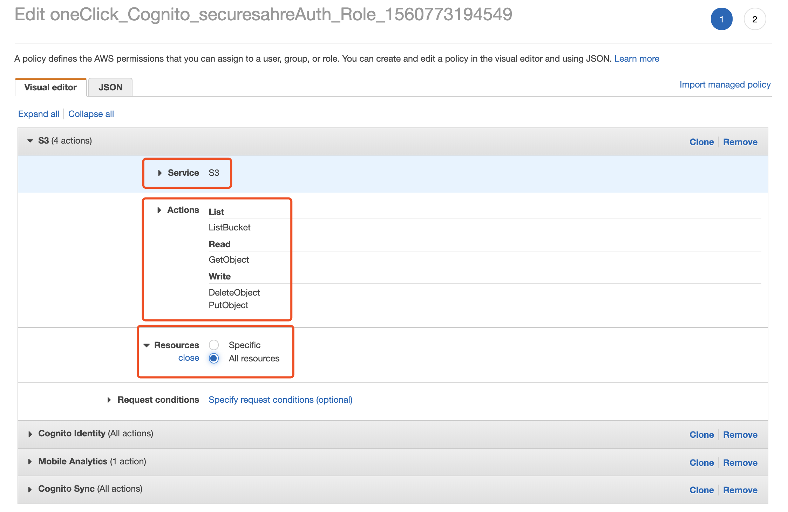
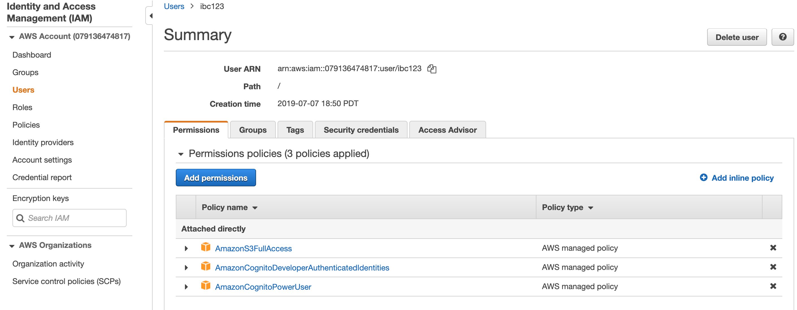

# Setup AWS

## 1 Cognito

> We use cognito to manage user authorization and access permission to S3

1. Find `Cognito` in AWS service and click `Manage User Pools`

2. Click `Create a user pool` in the top-right corner to create an User Pool. Specify a pool name like `ibc-secure-share-user-pool`, then click `Review defaults`


3. (Optional)Adjust the minimum password length or other password policies. Then click Create pool. Write down `Pool Id`(For example: `us-east-2_BIl3HiR85`)

4. Create a new App Client. Specify a name and click `Show Detail`, uncheck `Enable sign-in API for server-based authentication (ADMIN_NO_SRP_AUTH)`,
then click `Save app client changes`. The `App client secret` should show `no secret key`. Write down `App client id`(For example: `6qrmkcqeigje5hha1v88tgsar2`)


5. Create a new Identity Pool, say `ibc-secure-share-identity-pool`, Click `edit identity pool` in the top-right corner

6. Create an IAM role for the Identity Pool.



## 2 S3

1. Create a bucket, for example `ibc-secure-share-bucket`

2. Configure the Public Access Policy like the following figure,


3. Configure Bucket Policy with the following content. Note: change `ibc-secure-share-bucket` to your own bucket name.

```
{
    "Version": "2012-10-17",
    "Statement": [
        {
            "Action": [
                "s3:ListBucket"
            ],
            "Effect": "Allow",
            "Principal": "*",
            "Resource": [
                "arn:aws:s3:::ibc-secure-share-bucket"
            ],
            "Condition": {
                "StringLike": {
                    "s3:prefix": [
                        "${cognito-identity.amazonaws.com:sub}/*"
                    ]
                }
            }
        },
        {
            "Sid": "s-019e33572f2568026bd0b0476abb0edc",
            "Effect": "Allow",
            "Principal": "*",
            "Action": [
                "s3:GetObject",
                "s3:PutObject",
                "s3:DeleteObject"
            ],
            "Resource": [
                "arn:aws:s3:::ibc-secure-share-bucket/${cognito-identity.amazonaws.com:sub}",
                "arn:aws:s3:::ibc-secure-share-bucket/${cognito-identity.amazonaws.com:sub}/*"
            ]
        }
    ]
}
```


## 3 IAM

1. Open IAM console


2. Select the IAM role of the Identity Pool


3. Config S3 permission for the Role


4. Create a new ibc root user in IAM. Make sure all the three permissions below are granted ubder the `permission` tab.
    - AmazonS3FullAccess
    - AmazonCognitoDeveloperAuthenticatedIdentities
    - AmazonCognitoPowerUser

    Under `Security credentials` tab, click `Create access key` to generate `accessKeyId` and `secretAccessKey`.




## 4. Update Config

1. Update `resources/app/assets/cfg/config.json`

```
{
  "s3": {
    "bucket_name": "ibc-secure-share"
  }
}
```

```
{
  "cognito": {
    "identityPoolId": "us-east-2:ad58a792-7603-466a-a9da-2517921b5640",
    "userPoolId": "us-east-2_EcvlAWpEL",
    "clientId": "dlsu36gcu6s6r4bhhpsgi982f"
  }
}
```

For IBC user only, specify your `accessKeyId` and `secretAccessKey`
```
{
  "aws": {
    "accessKeyId": "us-east-2:ad58a792-7603-466a-a9da-2517921b5640",
    "secretAccessKey": "us-east-2_EcvlAWpEL",
  }
}
```
