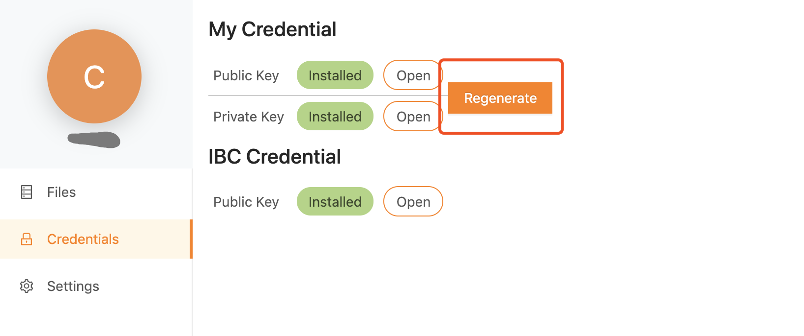

# Usage Doc

- Use the account `ibc` to login

- In the page `Files`, check the top-right corner, click the `New Company` button to create a new client. Besides, the company'd receive an email asking him/her to click an link provided by Amazon Cognito to activate his/her account.

- Every time `ibc` created a new company account, `secure-share` will create
  - A dedicated S3 folder for this company

- When a company account logged in `secure-share`, he/she needs to generate a  RSA key pair in the `Credentials` page. This key pair is used to encrypt files when `ibc` want to share files with the company

- User can import RSA key pairs in `Credential` page. To make it, users need to be sure the desired RSA key pairs are already in his/her computer.
